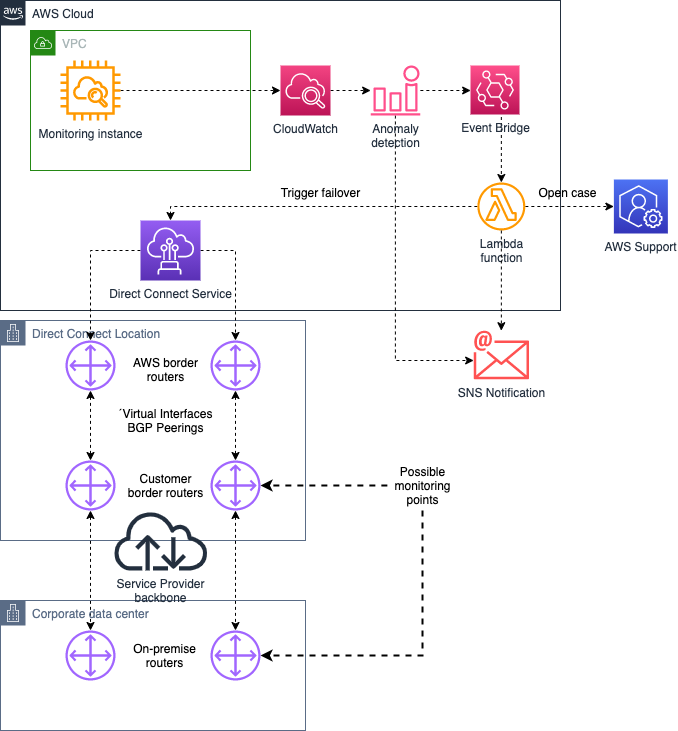

# aws-dx-failover

***aws-dx-failover*** contains sample code for the Blog Post (link to blog post).

## How it works

The following diagram expresses the high level system execution
architecture.

1. CloudWatch EventBridge receives an alarm that matches an event rule and triggers the Lambda function.
2. The first word of the Alarm Name must be the Virtual Interface ID of the VIF we want to put in "failover" mode.
3. The Lambda function interrogates the AWS Direct Connect service
   through Describe API calls for every VIF (the list of VIFs is provided as an environment variable) to get the state of them all.
3. If the VIF is already in an state different than "available", the Lambda function sends a notification and exits.
4. If the number of available VIFs is already at, or below, the minimum VIFs (also passed as an environment variable), the Lambda function sends a notification and exits.
5. Otherwise, the Lambda function uses the "AWS Direct Connect Failover Test" to put the alarmed VIF in "testing" mode, effectively disabling all BGP peers on the VIF. The time the VIF will remain in this state is configurable in another environment variable, the default is 180 minutes. Then the Lambda funcion opens a support case (only available for customers with Business or Enterprise Support plans) and sends a notification.

## Installation

Use the following steps to build and deploy the system.

### 1. Prerequisites

Before deploying this solution, you will need to have Direct Connect monitoring and CloudWatch alarms in place. See (blogpost link) for guidance.

### 2. Deploy the Lambda Function

- Create a new Lambda Function from scratch in the region where you deployed your monitoring.
- Use Python 3.9 as runtime.
- For the execution role, choose "Create a new role with basic Lambda permissions"
- Copy & paste the sample code contained in the file "dx-failover.py".

### 3. Grant permissions to the Lambda Function

- Modify the Lambda execution role to allow it describe VIFs, put VIFs in failover test, send notifications on SNS and open support cases.
- This can be done by adding an inline policy to the role. Sample JSON can be found in the file "lambda-iam-policy.json".

### 4. Configure Lambda function Environment variables

- The Lambda function uses the following environment variables, that must be added on the "Configuration" tab:

VIFLIST  - Comma separated list of VIF IDs (e.g. 'dxvif-ffq0wwww,dxvif-fgihxxxx')
MINVIFS  - Minimum number of VIFs to be kept in "available" state (e.g. '1' or '2')
SNSARN   - SNS Topic for sending notifications ARN (e.g. 'arn:aws:sns:eu-west-1:123456789012:DX-Failover-Topic')
FAILOVER - Time to put the VIF in "testing" mode (e.g. '180', '120')
EMAIL    - Email address to CC when opening a support case (e.g. 'name@example.com')

### 5. Create a CloudWatch EventBridge rule to trigger the Lambda Function

- Go to EventBridge service in the console and create a new rule in the AWS default event bus.
- Select your Lambda Function as the target
- Use "Event pattern" as the rule type.
- Select "Custom pattern" and paste the pattern that will match your alarms.
- A sample pattern can be found in the file "event-rule.json".
- You will need to save the pattern before creating the rule.

## Testing

- You may test this solution during a maintenance window by making the monitored IP addresses unavailable (for example, by shutting down the loopback interface in the router) and waiting for the CloudWatch Alarm to trigger the Lambda function.
- You can then review Lambda function logs in CloudWatch logs for errors.
- If you are using anomaly detection for alarms, make sure to exclude testing periods from the model.

## Security

See [CONTRIBUTING](CONTRIBUTING.md#security-issue-notifications) for more information.

## License

This library is licensed under the MIT-0 License. See the LICENSE file.
